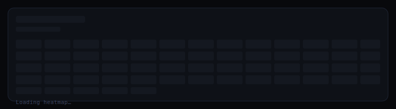
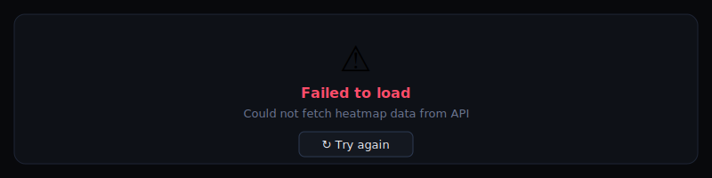
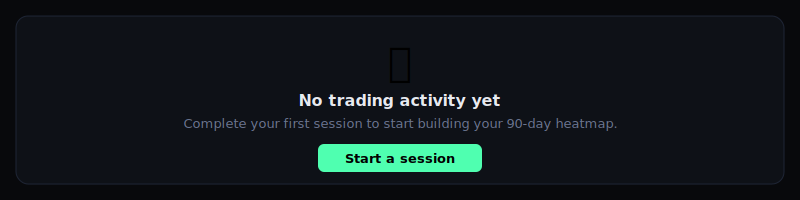
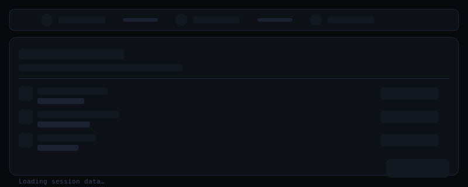
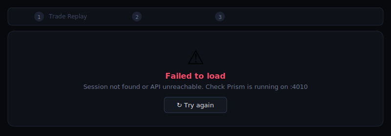
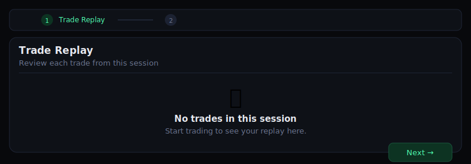
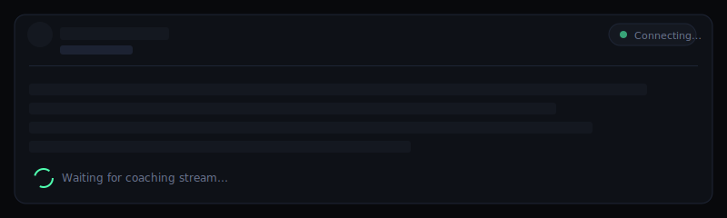
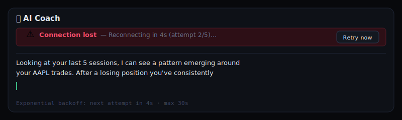
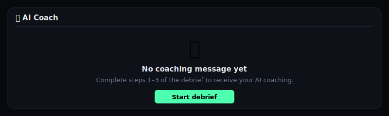

# NevUp Track 3 — System of Engagement

Post-session debrief flow + behavioural dashboard for retail day traders.

## Quick Start

```bash
# Docker (single command — no manual steps)
docker compose up
# App: http://localhost:3000
# Mock API: http://localhost:4010

# Local dev
npm install
npm run dev
```

## Features
- 10 trader profiles with behavioral pathologies from seed CSV
- Custom SVG heatmap (no library) — 90-day rolling, click to debrief
- 5-step debrief: trade replay → emotion tagging → adherence → AI coaching SSE → save
- SSE coaching with exponential backoff reconnect
- All 3 states (loading skeleton, error+retry, empty) per component

---

## Component States

### Heatmap (90-day rolling trade quality)

| Loading Skeleton | Error + Retry | Empty |
|:---:|:---:|:---:|
|  |  |  |

- **Loading**: shimmer grid of 91 skeleton cells while CSV metrics compute
- **Error**: full card with ⚠️ icon and "↻ Try again" action that triggers metric refetch
- **Empty**: shown when user has zero closed trades; CTA routes to first session

---

### Debrief Flow (5-step post-session review)

| Loading Skeleton | Error + Retry | Empty (no trades) |
|:---:|:---:|:---:|
|  |  |  |

- **Loading**: step-bar + card skeleton while session data fetches from Prism/local API
- **Error**: full-card error with session ID context and retry; shows if Prism is unreachable
- **Empty**: "No trades in this session" with helpful prompt; Next button disabled

---

### Coaching Panel (SSE streaming)

| Loading / Connecting | Error / Reconnecting | Empty (pre-debrief) |
|:---:|:---:|:---:|
|  |  |  |

- **Loading**: "Connecting…" badge + shimmer lines while SSE stream opens
- **Error**: red "Connection lost" banner with backoff countdown and "Retry now" button; exponential backoff `min(2^n * 1000ms, 30000ms)`; already-streamed tokens preserved on screen
- **Empty**: shown before steps 1–3 complete; CTA to start debrief

---

## Lighthouse CI

Verify the ≥ 90 score (Performance, Accessibility, Best Practices):

```bash
# 1. Build & start production server
npm run build
npm run start &

# 2. Run Lighthouse CI (reproducible from scratch)
npm run lhci
# Equivalent: npx lhci autorun

# Results written to ./lhci-results/
```

`lighthouserc.js` config: runs 3 audits per URL, asserts ≥ 90 on Performance / Accessibility / Best Practices, outputs filesystem JSON + HTML to `./lhci-results/`.

**Note:** Always run on a production build (`next build && next start`), not `next dev`.

---

## Auth Test (cross-tenant 403)

```bash
TOKEN=$(node -e "
const c=require('crypto'),s='97791d4db2aa5f689c3cc39356ce35762f0a73aa70923039d8ef72a2840a1b02';
const b=x=>Buffer.from(x).toString('base64').replace(/=/g,'').replace(/\+/g,'-').replace(/\//g,'_');
const now=Math.floor(Date.now()/1000);
const h=b(JSON.stringify({alg:'HS256',typ:'JWT'}));
const p=b(JSON.stringify({sub:'f412f236-4edc-47a2-8f54-8763a6ed2ce8',iat:now,exp:now+86400,role:'trader'}));
const sig=c.createHmac('sha256',s).update(h+'.'+p).digest('base64').replace(/=/g,'').replace(/\+/g,'-').replace(/\//g,'_');
console.log(h+'.'+p+'.'+sig);
")

# Alex's token requesting Jordan's data → must return HTTP 403
curl -i -H "Authorization: Bearer $TOKEN" \
  http://localhost:3000/api/local/users/fcd434aa-2201-4060-aeb2-f44c77aa0683/metrics
# Expected: HTTP/1.1 403 {"error":"FORBIDDEN","message":"Cross-tenant access denied.","traceId":"..."}
```
